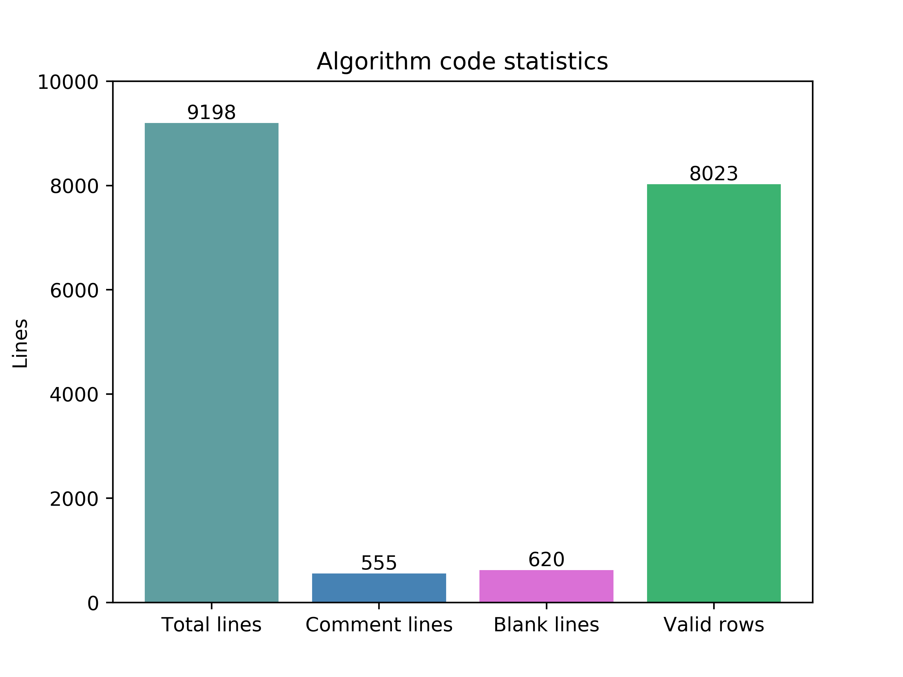

# C++ 学习

- [个人学习笔记](https://github.com/muyuuuu/Cpp-Learn)

# 基础数据结构

- [String 练习](https://muyuuuu.github.io/2019/03/31/C-string/)
- [array 练习](https://muyuuuu.github.io/2019/05/01/Cpp-Sequential-Container/)
- [vector 练习](https://muyuuuu.github.io/2019/05/01/Cpp-Sequential-Container/)
- [deque 练习](https://muyuuuu.github.io/2019/05/01/Cpp-Sequential-Container/)
- [list 练习](https://muyuuuu.github.io/2019/05/01/Cpp-Sequential-Container/)
- [set 练习](https://muyuuuu.github.io/2019/06/02/OJ-Cpp-cumulative/)
- [map 练习](https://muyuuuu.github.io/2019/06/02/OJ-Cpp-cumulative/)
- [stack练习](https://muyuuuu.github.io/2019/06/03/container-adaptor/)
- [queue练习](https://muyuuuu.github.io/2019/06/03/container-adaptor/)
- [priority_queue练习](https://muyuuuu.github.io/2019/06/03/container-adaptor/)

# 算法整理

- [哈希相关](https://muyuuuu.github.io/2021/03/14/hash/)

# 介绍

每天一道`OJ`，防止老年痴呆。大概是发现`Github`是个好东西后有了新鲜感？于是准备陆续的把一些代码放上来，也算是监督自己吧。

当然回到正题，会记录日常的OJ，如果是一类的算法题目，也会归结到`algorithm`里面。以C++为主，偶尔蹦出来几个python也不是不可能。整体画像如下，随缘更新。

    

## 第一阶段任务：PAT乙级熟悉C++

第一阶段任务，2020年2月4号开始，慢慢刷吧。大量参考了柳神的代码：https://github.com/liuchuo/PAT
2020-2-27结束乙级。共95道算法题。

## 第二阶段任务：PAT甲级练习数据结构

第二阶段任务，2020年3月4号开始，慢慢刷吧。比较难的数据结构还是不会。

## 第三阶段任务：leetcode按类型刷

2021年3月4号重启算法，慢慢来吧。

