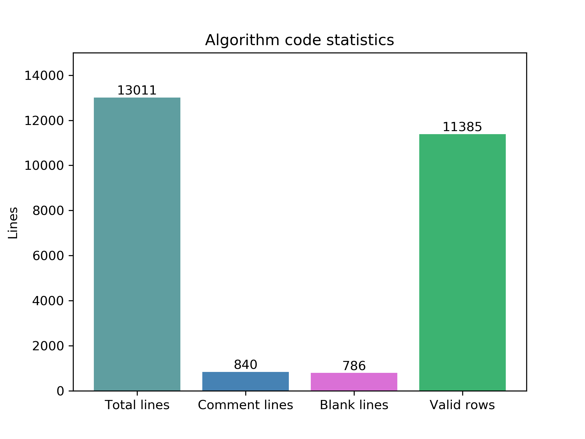

# 介绍

每天一道`OJ`，防止老年痴呆。大概是发现`Github`是个好东西后有了新鲜感？于是准备陆续的把一些代码放上来。当然回到正题，会记录日常的OJ，如果是一类的算法题目，也会归结到`algorithm`里面。以C++为主，偶尔蹦出来几个python也不是不可能。画像如下，随缘更新。

<p align="center">
    
</p>

# 第一阶段任务：PAT乙级熟悉C++

第一阶段任务，2020年2月4号开始，慢慢刷吧。
- 15分：简单的编程应用，涉及数组、分支、循环、判断等
- 20分：比较复杂的编程应用，逻辑复杂，但不涉及数据结构
- 25分：涉及简单的数据结构的使用，如`vector, map`等，不涉及算法，但涉及一些算法库的使用，如`algorithm`里的`sort`函数，同样需要合理设计逻辑，如哈希等，不然很容易出错。

## 不知为何出错的题目

- 1030 5分，看不懂题
- 1044 看不懂题在说什么，仿佛是为了考试而考试，没意思。
- 1088 18分，一个点没过
- 1033 19分，一个点没过
- 1073 14分，两个点没过，猜测算法设计的不好

## 记录

本人没学过C++，第一次接触，记录的东西可能有点low。1003，1030看不懂题，不知道他在说什么。1005题目的描述实在花了很长时间才看懂。对于这些题目没有做的兴趣。

1. `scanf` 代替 `cin` 可在某种程度上避免超时。
2. 快速排序前后，主元位置不变，否则常规思路会超时。乙级 1045。
3. `stof`, `stoi` 完成字符串转数字。乙级 1054。
4. `isdigital` 传入的变量是`char`类型。
5. `if` `if` `else` 和 `if` `else if` `else` 对代码的执行结果影响不一样。
6. [二维数组的定义](https://blog.csdn.net/FX677588/article/details/52708813)：传入常量不能传入参数。乙级1066。
7. 输出`3`位数，高位补0：`printf("%03d ", arr[i][j]);`。
8. 哈希时要考虑空间大小，`int a[99999][99999]` 太大了，可以考虑使用 Map。乙级1090。
9. `map`键对应的值不止一个时，值可以考虑用 `vector` 载入。
10. 数字转字符串：`to_string()`，字符串逆序(algorithm)：`reverse(s.begin(), s.end());`，乙级1086。
11. 虽然链表可以考虑顺序结构和链式结构实现，但巧妙的软换会比两者都好。乙级1075。
12. `map`配合`hash`能有效提升程序的效率。乙级1065。
14. 在不知数据量多少的情况下，读取所有输入 `while(cin >> temp)`。乙级1009。
15. 尽量避免批量的命名数组，重复的操作很容易超时，同一种思维也能换一种写法。乙级1015。
16. 虽然我不知道我的哪里错了，但学习到了`abs(j - i) * 1.0 / x != abs(j - i) / x`。乙级1088。
17. `cin`时注意输入的与声明的数据类型是否有差异。乙级1053。
18. 乙级1085，差 `20ms` 超时。`if else`写法比三元运算符写法耗时。
```cpp
int cmp(node1 a, node1 b)
{
    if (a.score != b.score)
        return a.score > b.score;
    else
    {
        if (a.num != b.num)
            return a.num < b.num;
        else
            return a.id < b.id;
    }
}
```
不如`return a.score != b.score ? a.score > b.score : a.num != b.num ? a.num < b.num : a.id < b.id;`

19. 尽量不要操作一次删除一次，很容易超时，尽量以下标移动去解决问题。乙级1055。

## 完结

2020-2-27结束乙级。共95道算法题。大量参考了柳神的代码：https://github.com/liuchuo/PAT

# 第二阶段任务：PAT甲级练习数据结构

第二阶段任务，2020年3月4号开始，慢慢刷吧。

## 记录

1. `vector<int> a(10, 1)`的含义为声明一个长度为10的不定长数组且全部初始化为 1 。
2. 当借助结构体的多条件排序需要比较的条件比较多时，可以考虑结构体中放数组。甲级1012。
3. 求两个递增序列的中位数，直接`sort`会超时，且有更好的算法，提前计算中位数的位置即可。甲级1029。
4. 运算的括号可能会加长运算时间而超时，也可考虑更换`cin`为`scanf`，`cout`为`printf`。甲级1055。