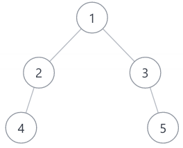

- [广度优先遍历](#广度优先遍历)
  - [剑指 Offer 32 - I. 从上到下打印二叉树](#剑指-offer-32---i-从上到下打印二叉树)
  - [剑指 Offer 32 - II. 从上到下打印二叉树 II](#剑指-offer-32---ii-从上到下打印二叉树-ii)
  - [剑指 Offer 32 - III. 从上到下打印二叉树 III](#剑指-offer-32---iii-从上到下打印二叉树-iii)

# 广度优先遍历

广度优先遍历的模板，常用于最短路径的搜索。

```cpp
deque<type> q;
q.push_back(root);
while (q.size()) {
  int s = q.size();
  auto node = q.front();
  q.pop_front();
  if (node->left != target)
    q.push_back(node->left);
  if (node->right != target)
    q.push_back(node->right);
}
```

## 剑指 Offer 32 - I. 从上到下打印二叉树

从上到下打印出二叉树的每个节点，同一层的节点按照从左到右的顺序打印。这个并不是最短路径的搜索，而是层序遍历二叉树，并按照从左到右的顺序输出。因此，bfs 的时候只需要逐层的添加节点即可。

```cpp
class Solution {
public:
  vector<int> levelOrder(TreeNode* root) {
    if (root == NULL)
      return {};
    vector<int> res;
    deque<TreeNode*> q;
    q.push_back(root);
    while (q.size()) {
      int s = q.size();
      for (int i = 0; i < s; i++) {
        auto node = q.front();
        q.pop_front();
        res.push_back(node->val);
        if (node->left != NULL)
          q.push_back(node->left);
        if (node->right != NULL)
          q.push_back(node->right);
      }
    }
    return res;
  }
};
```

## 剑指 Offer 32 - II. 从上到下打印二叉树 II

这个题和上面的题比较类似，无非是增加一个额外的数组存储每层的遍历结果罢了。我选择在每一层弹出的时候进行存储。

```cpp
class Solution {
public:
  vector<vector<int>> levelOrder(TreeNode* root) {
    if (root == NULL)
      return {};
    vector<vector<int>> res;
    deque<TreeNode*> q;
    q.push_back(root);
    vector<int> tmp;
    while (q.size()) {
      int s = q.size();
      for (int i = 0; i < s; i++) {
        auto node = q.front();
        q.pop_front();
        tmp.push_back(node->val);
        if (node->left != NULL)
          q.push_back(node->left);
        if (node->right != NULL)
          q.push_back(node->right);
      }
      res.push_back(tmp);
      tmp.clear();
    }
    return res;
  }
};
```

## 剑指 Offer 32 - III. 从上到下打印二叉树 III

这个是「之」字形打印，但是遇到特殊的二叉树时不太容易处理：



所以就正常顺序遍历，最后对结果进行逆序。

```cpp
class Solution {
public:
  vector<vector<int>> levelOrder(TreeNode* root) {
    if (root == nullptr)
      return {};
    
    vector<vector<int>> res;
    vector<int> tmp;
    deque<TreeNode*> q;
    q.push_back(root);
    int idx{0};
    
    while (q.size()) {
      int s = q.size();
      for (int i = 0; i < s; i++) {
        auto node = q.front();
        q.pop_front();
        tmp.push_back(node->val);
        if (node->left != nullptr)
          q.push_back(node->left);
        if (node->right != nullptr)
          q.push_back(node->right);
      }
      res.push_back(tmp);
      tmp.clear();
    }

    for (int i = 0; i < res.size(); i++) {
      if (i % 2 == 1) {
        reverse(res[i].begin(), res[i].end());
      }
    }

    return res;
  }
};
```