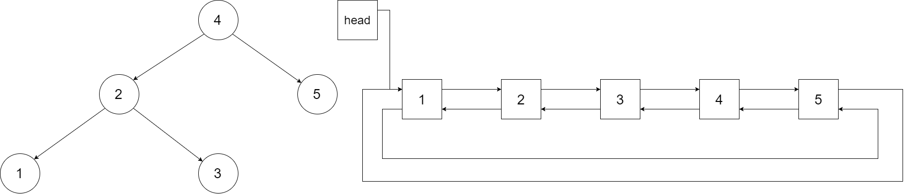

- [树](#树)
  - [剑指 Offer 26. 树的子结构](#剑指-offer-26-树的子结构)
  - [剑指 Offer 27. 二叉树的镜像](#剑指-offer-27-二叉树的镜像)
  - [剑指 Offer 36. 二叉搜索树与双向链表](#剑指-offer-36-二叉搜索树与双向链表)
  - [剑指 Offer 37. 序列化二叉树](#剑指-offer-37-序列化二叉树)
  - [剑指 Offer 55 - I. 二叉树的深度](#剑指-offer-55---i-二叉树的深度)

# 树

用一句话总结，树能很好的考验算法设计能力和递归理解能力。

## 剑指 Offer 26. 树的子结构

输入两棵二叉树A和B，判断B是不是A的子结构。(约定空树不是任意一个树的子结构)。B是A的子结构， 即 A中有出现和B相同的结构和节点值。

一点一点来分析题目：首先在 A 和 B 中进行查找，如果不满足，就查找 A 的左子树或右子树，这样，递归的思想就出来了。查找函数是题目给定的，只需要递归调用题目的查找函数即可，需要注意的是，如果 A 的子树或者 B 的为空，返回 false，表示 B 为空树或者 A 中没有找到。

那么如何衡量有没有找到呢？就需要在写一个查找函数：

- B 为空，表示 B 被遍历完毕，返回 true
- A 为空，表示没找到，返回 false
- A B 不空的情况下数值不等，返回 false
- 否则表示 A 和 B 当前节点相等，继续比较 A 的左子树和 B 的左子树，A 的右子树和 B 的右子树

```cpp
class Solution {
public:
  bool isSubStructure(TreeNode* A, TreeNode* B) {
    if (B == nullptr)
      return false;
    if (A == nullptr)
      return false;
    bool a = dfs(A, B);
    bool b = isSubStructure(A->left, B);
    bool c = isSubStructure(A->right, B);
    return a || b || c;
  }

  bool dfs(TreeNode* A, TreeNode* B) {
    if (B == nullptr)
      return true;
    if (A == nullptr)
      return false;
    if (A->val != B->val)
      return false;
    return dfs(A->left, B->left) && dfs(A->right, B->right);
  }
};
```

## 剑指 Offer 27. 二叉树的镜像

请完成一个函数，输入一个二叉树，该函数输出它的镜像。

刚开始想的是从二叉树的底层开始镜像反转，发现无法实现。后来冷静分析下，发现从二叉树的根开始反转也是可以的。同样还是递归解决的思想，反转一个节点，而后反转它的子节点，递归即可。

```cpp
class Solution {
public:
  TreeNode* mirrorTree(TreeNode* root) {
    reverse(root);
    return root;
  }
  void reverse(TreeNode* root) {
    if (root == NULL)
      return;
    TreeNode* tmp;
    tmp = root->left;
    root->left = root->right;
    root->right = tmp;
    reverse(root->left);
    reverse(root->right);
  }
};
```

## 剑指 Offer 36. 二叉搜索树与双向链表

输入一棵二叉搜索树，将该二叉搜索树转换成一个排序的循环双向链表。要求不能创建任何新的节点，只能调整树中节点指针的指向。



既然题目不允许新建节点，意思就是：不允许存储并排序二叉树遍历的结果，而后对排序的序列创建链表。二叉搜索树在左根右的情况下遍历是有序的，因此中序遍历二叉树而后调整指针指向。由于是双向链表，因此必须加入 prev, curr 和 next 指针，由于题目遍历二叉树的过程会自动遍历节点，不需要 next 节点向后搜索且默认提供了 curr 节点，因此只额外引入 prev 节点。

遍历期间，需要保留二叉树最左侧的节点，其左侧指向空指针。对于其他节点，当前指针的左侧是 prev 指针，prev 的右指针是当前指针，而后移动 prev 到当前指针即可。最后进行收尾工作，链表的头节点的左指针指向尾节点，尾节点的右指针指向头节点。

```cpp
class Solution {
  public:
    Node* curr = nullptr;
    Node* prev = nullptr;
    
    Node* treeToDoublyList(Node* root) {
      if (root == nullptr)
        return nullptr;
      inorder(root);
      curr->left = prev;
      prev->right = curr;
      return curr;
    }
    void inorder(Node* node) {
      if (node == nullptr)
        return;
      inorder(node->left);
      if (prev != nullptr) {
        prev->right = node;
      } else {
        curr = node;
      }
      node->left = prev;
      prev = node;
      inorder(node->right);
    }
  };
```

## 剑指 Offer 37. 序列化二叉树

其实就是二叉树转字符串，在从字符串转回二叉树。那么就有几个注意事项：

1. 二叉树转字符串，建议用先序遍历，这样字符串返回二叉树的时候也简单
2. 二叉树如何转字符串，字符串就如何返回二叉树，都是递归；二叉树到字符串需要额外的函数，那么字符串到二叉树也需要额外的函数
3. 二叉树到字符串时，避免 12 被解析为 1 和 2，建议每个数字后加一个空格，空指针用特殊字符表示
4. 那么在字符串到二叉树时，就需要将带空格的字符串解析到一个 vecotr 中拿到数字，可以借助 `stringstream` 实现，位于头文件 `<sstream>` 中。

```cpp
class Codec {
public:

  string res{""};
  int idx{0};
  // Encodes a tree to a single string.
  string serialize(TreeNode* root) {
    dfs(root);
    return res;
  }

  void dfs(TreeNode* node) {
    if (node == nullptr) {
      res += '#';
      res += ' ';
      return;
    }
    res += to_string(node->val);
    res += ' ';
    dfs(node->left);
    dfs(node->right);
  }

  // Decodes your encoded data to tree.
  TreeNode* deserialize(string data) {
    stringstream ss(data);
    vector<string> token;
    string buf;
    while (ss >> buf) {
      token.push_back(buf);
    }
    
    if (token.size() == 1 && token[0] == "#")
      return nullptr;
    TreeNode* root = build(token);
    return root;
  }

  TreeNode* build(vector<string>& token) {
    if (token[idx] == "#" || idx >= token.size()) {
      idx ++;
      return nullptr;
    }
    TreeNode* node = new TreeNode(stoi(token[idx]));
    idx++;
    node->left = build(token);
    node->right = build(token);
    return node;
  }
};
```

## 剑指 Offer 55 - I. 二叉树的深度

由于每次递归调用的递归函数中会存储属于自己的临时变量，因此不需要回溯。

```cpp
class Solution {
public:
  int res{-1};
  int maxDepth(TreeNode* root) {
    if (root == NULL)
      return 0;
    int depth = 0;
    dfs(root, depth + 1);
    return res;
  }

  void dfs(TreeNode* node, int depth) {
    if (node == NULL)
      return;
    if (depth > res)
      res = depth;
    dfs(node->left, depth+1);
    dfs(node->right, depth+1);
  }
};
```