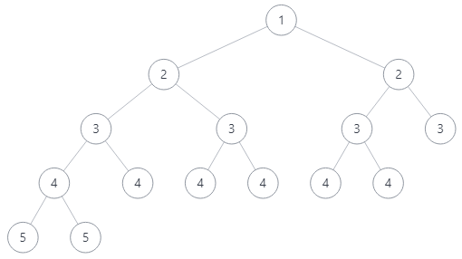

- [树](#树)
  - [剑指 Offer 26. 树的子结构](#剑指-offer-26-树的子结构)
  - [剑指 Offer 28. 对称的二叉树](#剑指-offer-28-对称的二叉树)
  - [剑指 Offer 27. 二叉树的镜像](#剑指-offer-27-二叉树的镜像)
  - [剑指 Offer 36. 二叉搜索树与双向链表](#剑指-offer-36-二叉搜索树与双向链表)
  - [剑指 Offer 37. 序列化二叉树](#剑指-offer-37-序列化二叉树)
  - [剑指 Offer 55 - I. 二叉树的深度](#剑指-offer-55---i-二叉树的深度)
  - [剑指 Offer 54. 二叉搜索树的第k大节点](#剑指-offer-54-二叉搜索树的第k大节点)
  - [剑指 Offer 55 - II. 平衡二叉树](#剑指-offer-55---ii-平衡二叉树)
  - [剑指 Offer 68 - II. 二叉树的最近公共祖先](#剑指-offer-68---ii-二叉树的最近公共祖先)
  - [剑指 Offer 68 - I. 二叉搜索树的最近公共祖先](#剑指-offer-68---i-二叉搜索树的最近公共祖先)
  - [剑指 Offer 33. 二叉搜索树的后序遍历序列](#剑指-offer-33-二叉搜索树的后序遍历序列)

# 树

用一句话总结，树能很好的考验算法设计能力和递归理解能力。

## 剑指 Offer 26. 树的子结构

输入两棵二叉树A和B，判断B是不是A的子结构。(约定空树不是任意一个树的子结构)。B是A的子结构， 即 A中有出现和B相同的结构和节点值。

一点一点来分析题目：首先在 A 和 B 中进行查找，如果不满足，就查找 A 的左子树或右子树，这样，递归的思想就出来了。查找函数是题目给定的，只需要递归调用题目的查找函数即可，需要注意的是，如果 A 的子树或者 B 的为空，返回 false，表示 B 为空树或者 A 中没有找到。

那么如何衡量有没有找到呢？就需要在写一个查找函数：

- B 为空，表示 B 被遍历完毕，返回 true
- A 为空，表示没找到，返回 false
- A B 不空的情况下数值不等，返回 false
- 否则表示 A 和 B 当前节点相等，继续比较 A 的左子树和 B 的左子树，A 的右子树和 B 的右子树

```cpp
class Solution {
public:
  bool isSubStructure(TreeNode* A, TreeNode* B) {
    if (B == nullptr)
      return false;
    if (A == nullptr)
      return false;
    bool a = dfs(A, B);
    bool b = isSubStructure(A->left, B);
    bool c = isSubStructure(A->right, B);
    return a || b || c;
  }

  bool dfs(TreeNode* A, TreeNode* B) {
    if (B == nullptr)
      return true;
    if (A == nullptr)
      return false;
    if (A->val != B->val)
      return false;
    return dfs(A->left, B->left) && dfs(A->right, B->right);
  }
};
```

## 剑指 Offer 28. 对称的二叉树

请实现一个函数，用来判断一棵二叉树是不是对称的。如果一棵二叉树和它的镜像一样，那么它是对称的。对于 `bfs` 这种递归调用的算法而言，定义一个递归函数，然后无条件相信它。这个题树章节的树的子结构类似，定义一个函数：

1. 如果都为空，说明遍历完毕，返回 true
2. 如果其中一个空，另外一个不是空，或者两者数值不等，返回 false
3. 否则，返回子节点的遍历结果

```cpp
class Solution {
public:
  bool isSymmetric(TreeNode* root) {
    if (root == nullptr)
      return true;
    return dfs(root->left, root->right);
  }

  bool dfs(TreeNode* node1, TreeNode* node2) {
    if (node1 == nullptr && node2 == nullptr) {
      return true;
    }
    if (node1 == nullptr || node2 == nullptr || node1->val != node2->val) {
      return false;
    }
    return dfs(node1->left, node2->right) && dfs(node1->right, node2->left);
  }
};
```

## 剑指 Offer 27. 二叉树的镜像

请完成一个函数，输入一个二叉树，该函数输出它的镜像。

刚开始想的是从二叉树的底层开始镜像反转，发现无法实现。后来冷静分析下，发现从二叉树的根开始反转也是可以的。同样还是递归解决的思想，反转一个节点，而后反转它的子节点，递归即可。

```cpp
class Solution {
public:
  TreeNode* mirrorTree(TreeNode* root) {
    reverse(root);
    return root;
  }
  void reverse(TreeNode* root) {
    if (root == NULL)
      return;
    TreeNode* tmp;
    tmp = root->left;
    root->left = root->right;
    root->right = tmp;
    reverse(root->left);
    reverse(root->right);
  }
};
```

## 剑指 Offer 36. 二叉搜索树与双向链表

输入一棵二叉搜索树，将该二叉搜索树转换成一个排序的循环双向链表。要求不能创建任何新的节点，只能调整树中节点指针的指向。


既然题目不允许新建节点，意思就是：不允许存储并排序二叉树遍历的结果，而后对排序的序列创建链表。二叉搜索树在左根右的情况下遍历是有序的，因此中序遍历二叉树而后调整指针指向。由于是双向链表，因此必须加入 prev, curr 和 next 指针，由于题目遍历二叉树的过程会自动遍历节点，不需要 next 节点向后搜索且默认提供了 curr 节点，因此只额外引入 prev 节点。

遍历期间，需要保留二叉树最左侧的节点，其左侧指向空指针。对于其他节点，当前指针的左侧是 prev 指针，prev 的右指针是当前指针，而后移动 prev 到当前指针即可。最后进行收尾工作，链表的头节点的左指针指向尾节点，尾节点的右指针指向头节点。

```cpp
class Solution {
  public:
    Node* curr = nullptr;
    Node* prev = nullptr;
    
    Node* treeToDoublyList(Node* root) {
      if (root == nullptr)
        return nullptr;
      inorder(root);
      curr->left = prev;
      prev->right = curr;
      return curr;
    }
    void inorder(Node* node) {
      if (node == nullptr)
        return;
      inorder(node->left);
      if (prev != nullptr) {
        prev->right = node;
      } else {
        curr = node;
      }
      node->left = prev;
      prev = node;
      inorder(node->right);
    }
  };
```

## 剑指 Offer 37. 序列化二叉树

其实就是二叉树转字符串，在从字符串转回二叉树。那么就有几个注意事项：

1. 二叉树转字符串，建议用先序遍历，这样字符串返回二叉树的时候也简单
2. 二叉树如何转字符串，字符串就如何返回二叉树，都是递归；二叉树到字符串需要额外的函数，那么字符串到二叉树也需要额外的函数
3. 二叉树到字符串时，避免 12 被解析为 1 和 2，建议每个数字后加一个空格，空指针用特殊字符表示
4. 那么在字符串到二叉树时，就需要将带空格的字符串解析到一个 vecotr 中拿到数字，可以借助 `stringstream` 实现，位于头文件 `<sstream>` 中。

```cpp
class Codec {
public:

  string res{""};
  int idx{0};
  // Encodes a tree to a single string.
  string serialize(TreeNode* root) {
    dfs(root);
    return res;
  }

  void dfs(TreeNode* node) {
    if (node == nullptr) {
      res += '#';
      res += ' ';
      return;
    }
    res += to_string(node->val);
    res += ' ';
    dfs(node->left);
    dfs(node->right);
  }

  // Decodes your encoded data to tree.
  TreeNode* deserialize(string data) {
    stringstream ss(data);
    vector<string> token;
    string buf;
    while (ss >> buf) {
      token.push_back(buf);
    }
    
    if (token.size() == 1 && token[0] == "#")
      return nullptr;
    TreeNode* root = build(token);
    return root;
  }

  TreeNode* build(vector<string>& token) {
    if (token[idx] == "#" || idx >= token.size()) {
      idx ++;
      return nullptr;
    }
    TreeNode* node = new TreeNode(stoi(token[idx]));
    idx++;
    node->left = build(token);
    node->right = build(token);
    return node;
  }
};
```

## 剑指 Offer 55 - I. 二叉树的深度

由于每次递归调用的递归函数中会存储属于自己的临时变量，因此不需要回溯。

```cpp
class Solution {
public:
  int res{-1};
  int maxDepth(TreeNode* root) {
    if (root == NULL)
      return 0;
    int depth = 0;
    dfs(root, depth + 1);
    return res;
  }

  void dfs(TreeNode* node, int depth) {
    if (node == NULL)
      return;
    if (depth > res)
      res = depth;
    dfs(node->left, depth+1);
    dfs(node->right, depth+1);
  }
};
```

## 剑指 Offer 54. 二叉搜索树的第k大节点

这个题目考察的是二叉树的遍历，因为二叉搜索树是有序的，那么右根左这样遍历到第 k 次，就是第 k 大的节点。

```cpp
class Solution {
public:
  int res, num = 0;
  int kthLargest(TreeNode* root, int k) {
    num = k;
    inorder(root);
    return res;
  }
  void inorder(TreeNode* node) {
    if (node == NULL)
      return;
    inorder(node->right);
    num --;
    if (num == 0) {
      res = node->val;
      return;
    }
    inorder(node->left);
  }
};
```

## 剑指 Offer 55 - II. 平衡二叉树

输入一棵二叉树的根节点，判断该树是不是平衡二叉树。如果某二叉树中任意节点的左右子树的深度相差不超过1，那么它就是一棵平衡二叉树。想不到有一天被简单题难到了，其实还是递归理解的不到位。需要注意的是，以下的图也是平衡二叉树。



通过上图，我们可以理解为：二叉树的左右子树的深度是取得最大值。通过递归遍历，返回子树的最大深度，如果差值大于 1，返回 -1。判断最终结果是不是 -1 即可。

```cpp
class Solution {
public:
  bool isBalanced(TreeNode* root) {
    return dfs(root) >= 0;
  }
  int dfs(TreeNode* node) {
    if (node == nullptr)
      return 0;
    int l = dfs(node->left);
    int r = dfs(node->right);
    if (l == -1 || r == -1 || abs(l - r) > 1)
      return -1;
    return max(l, r) + 1;
  }
};
```

## 剑指 Offer 68 - II. 二叉树的最近公共祖先

带状态的后序遍历。为什么要使用后序遍历呢？因为只有知道了子树的状态，才能确定根节点的状态。因此当字数等于目标时，返回 1，否则返回 0。当前节点返回的值时子树的和，如果当前节点子树的和为 2，那么就说明当前节点是最近的公共节点。

```cpp
class Solution {
public:
  TreeNode* res = nullptr;
  TreeNode* lowestCommonAncestor(TreeNode* root, TreeNode* p, TreeNode* q) {
    int a = dfs(root, p, q);
    return res;
  }
  int dfs(TreeNode* root, TreeNode* p, TreeNode* q) {
    if (root == nullptr) {
      return 0;
    }
    int l = dfs(root->left, p, q);
    int r = dfs(root->right, p, q);
    int a = 0;
    if (root == p || root == q)
      a = 1;
    a += l + r;
    if (a == 2 && res == nullptr)
      res = root;
    return a;
  }
};
```

## 剑指 Offer 68 - I. 二叉搜索树的最近公共祖先

和上一道题不同的是，这个题目是二叉搜索树，因此我们可以借助二叉搜索树的特性进行求解。还是先上带状态的后序遍历求解方法：

```cpp
class Solution {
public:
  TreeNode* res = nullptr;
  int a{-1}, b{-1};
  TreeNode* lowestCommonAncestor(TreeNode* root, TreeNode* p, TreeNode* q) {
    dfs(root, p, q);
    return res;
  }
  int dfs(TreeNode* root, TreeNode* p, TreeNode* q) {
    if (root == nullptr)
      return 0;
    int l = dfs(root->left, p, q);
    int r = dfs(root->right, p, q);
    int a = 0;
    if (root == p || root == q) {
      a = 1;
    }
    a += (l + r);
    if (a == 2 && res == nullptr)
      res = root;
    return a;
  }
};
```

从根节点开始遍历：

- 如果节点大于 p 和 q，说明 p q 在当前节点的左子树
- 如果节点小于 p 和 q，说明 p q 在当前节点的右子树
- 否则，当前节点就是分叉点，返回分叉点即可

```cpp
class Solution {
public:
  TreeNode* lowestCommonAncestor(TreeNode* root, TreeNode* p, TreeNode* q) {
    TreeNode* res = root;
    while (1) {
      if (root->val > p->val && root->val > q->val) {
        root = root->left;
      }
      else if (root->val < p->val && root->val < q->val) {
        root = root->right;
      }
      else {
        res = root;
        break;
      }
    }
    return res;
  }
};
```

## 剑指 Offer 33. 二叉搜索树的后序遍历序列

输入一个整数数组，判断该数组是不是某二叉搜索树的后序遍历结果。如果是则返回 true，否则返回 false。假设输入的数组的任意两个数字都互不相同。

刚开始看到这个题目的时候有点晕，无从下手的感觉，看了题解后好一些了。从先从序列的开始到结尾分治处理，因为末尾节点一定是根节点，因此我们找到第一个大于根节点的节点，那么他一定是右子树。此时进行判断，右子树到根节点的位置中，所有节点一定大于根节点。然后分治处理左子树和右子树即可。

```cpp
class Solution {
public:
  bool verifyPostorder(vector<int>& postorder) {
    return check(0, postorder.size() - 1, postorder);
  }

  bool check(int i, int j, vector<int>& postorder) {
    if (i >= j)
      return true;
    int p = i;
    while (postorder[p] < postorder[j]) {
      p++;
    }
    int m = p;
    while (postorder[p] > postorder[j]) {
      p++;
    }
    return (p == j) && check(i, m - 1, postorder) && check(m, j - 1, postorder);
  }
};
```